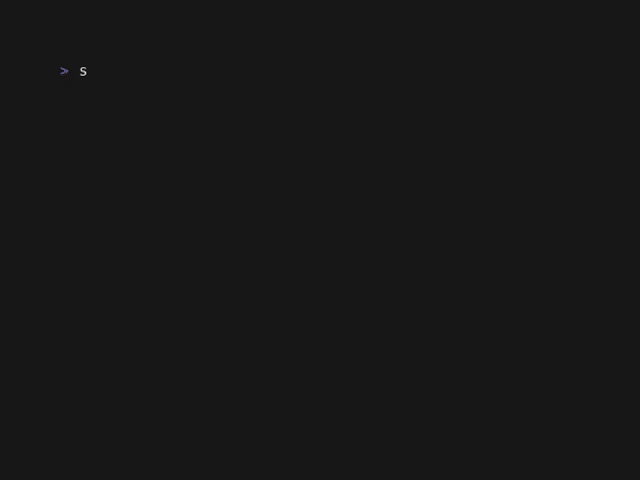

# snglrtty

<p align="center">

</p>

> **snglrtty** - audio pulled into the terminal, no escape

Terminal audio visualizer. Reads live audio from PulseAudio, renders a circular spectrum analyzer in your TTY using ASCII characters and ANSI colors.

## What it does

Captures system audio via the PulseAudio monitor source and draws a radial spectrum — a ring of frequency bars pulsing outward from a center circle. Looks like a black hole eating sound.

## Demo

Default

<p align="center">

</p>

Ghost Mode and higher decay on Catppuccin Mocha Shell

<p align="center">

</p>

Fire Theme

<p align="center">

</p>

## Requirements

- Linux with PulseAudio (or PipeWire + PulseAudio compatibility layer)
- `pactl` in `$PATH`
- Rust toolchain

## Pre-built packages

Download the latest package for your distribution from the
[GitHub Releases](https://github.com/the-unknown/snglrtty/releases) page:

| Distribution    | Package                                   | Install command                         |
| --------------- | ----------------------------------------- | --------------------------------------- |
| Debian / Ubuntu | `snglrtty_<version>_amd64.deb`            | `sudo dpkg -i snglrtty_*.deb`           |
| Fedora / RHEL   | `snglrtty-<version>-1.x86_64.rpm`         | `sudo rpm -i snglrtty-*.rpm`            |
| Arch Linux      | `snglrtty-<version>-1-x86_64.pkg.tar.zst` | `sudo pacman -U snglrtty-*.pkg.tar.zst` |
| Any Linux       | `snglrtty-<version>-x86_64-linux.tar.gz`  | Extract and copy binary to your `$PATH` |

## Build from source

```sh
cargo build --release
./target/release/snglrtty
```

Or with Make:

```sh
make && make install  # install without root
make uninstall  # remove
```

Make sure audio is playing. The visualizer reads whatever your default sink is monitoring.

## Options

| Flag       | Short | Default   | Description                                                |
| ---------- | ----- | --------- | ---------------------------------------------------------- |
| `--theme`  | `-t`  | `default` | Color theme (`default`, `fire`, `ocean`, `forest`, `mono`) |
| `--bars`   | `-b`  | `64`      | Number of frequency bars                                   |
| `--decay`  | `-d`  | `0.8`     | Trail decay factor (0.0–1.0, higher = longer trail)        |
| `--radius` | `-r`  | `6.0`     | Circle radius (relative to terminal height)                |
| `--ghost`  | `-g`  | off       | Ghost mode — bars only, no circle outline                  |

```sh
snglrtty --theme fire --bars 128 --ghost
snglrtty -t ocean -d 0.95 -r 8
```

## How it works

1. Detects default PulseAudio sink via `pactl get-default-sink`
2. Opens a monitor source (`<sink>.monitor`) for recording
3. Reads 200 samples at 44100 Hz mono F32LE
4. Splits samples into 64 frequency bands, averages amplitude per band
5. Draws a circle + radial bars onto a 2D float buffer
6. Applies 0.8× decay each frame for trail effect
7. Maps amplitude to ASCII: `#` `+` `*` `.` with ANSI colors

## License

MIT
